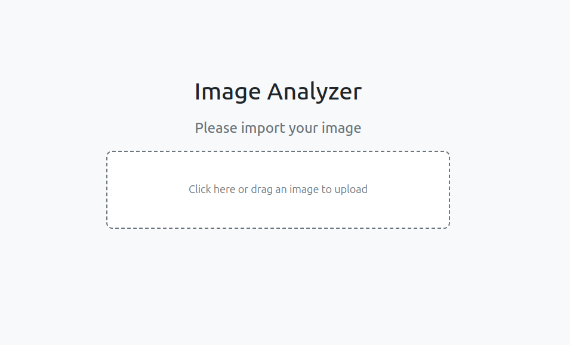
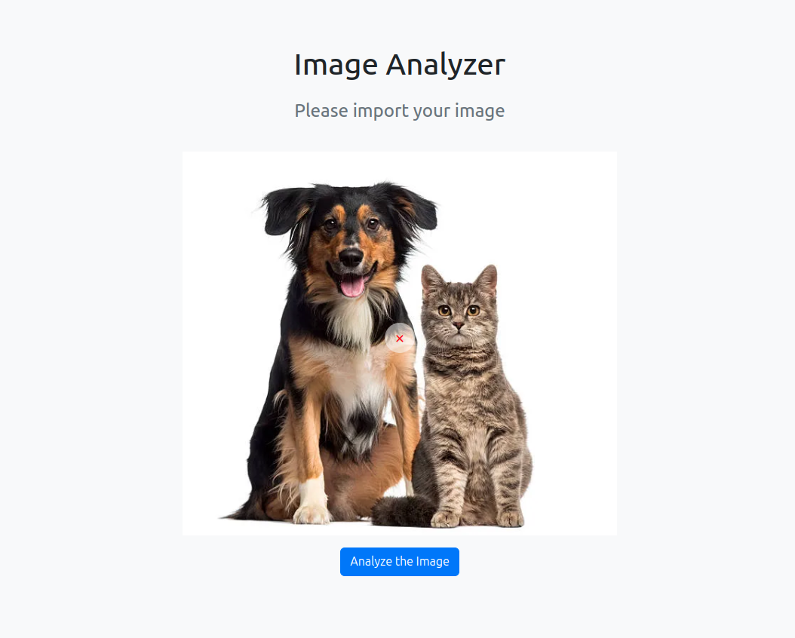
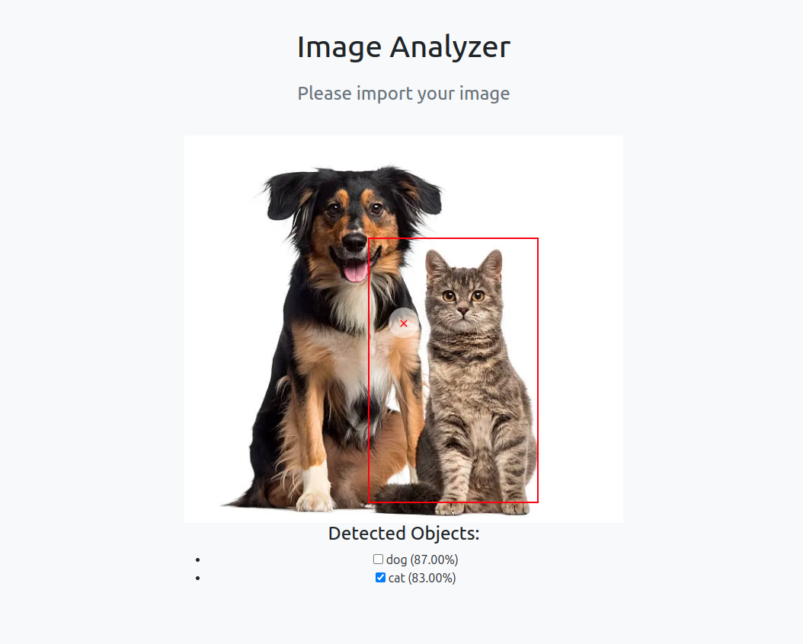
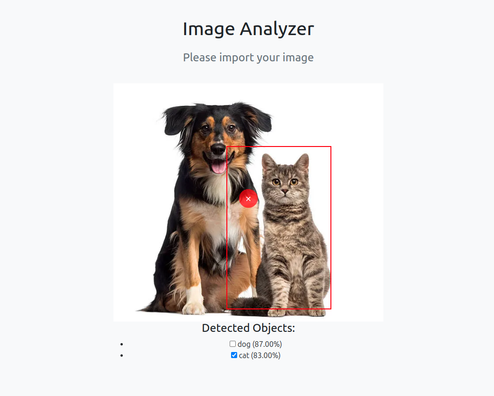

# Image Analyzer

This is a web-based application built with Django that allows users to upload an image, analyze it for objects using YOLO, and view detected objects with bounding boxes. Users can toggle the visibility of bounding boxes and interact with the analysis.

---

## Features

- **Drag-and-drop interface**: Easily upload images by dragging and dropping them.
- **Object detection**: Automatically detects objects in uploaded images using YOLO.
- **Interactive bounding boxes**: Users can toggle the visibility of bounding boxes for detected objects.
- **Lightweight interface**: A clean and responsive UI for a smooth user experience.

---

## Prerequisites

- Python 3.10 or higher
- Virtual environment tool like `venv` or `virtualenv`

---

## Installation

1. **Clone this repository**:

    ```bash
    git clone https://github.com/your-repo-name/image-analyzer.git
    cd image-analyzer
    ```

2. **Set up a virtual environment**:

    ```bash
    python3 -m venv ImageAnalysisVenv
    source ImageAnalysisVenv/bin/activate
    ```

3. **Install dependencies**:

    ```bash
    pip install -r requirements.txt
    ```

4. **Set up Django**:

    - Migrate the database:

        ```bash
        python manage.py migrate
        ```

    - Create a superuser (optional):

        ```bash
        python manage.py createsuperuser
        ```

---

## Running the Application

1. Start the Django development server:

    ```bash
    python manage.py runserver
    ```

2. Open a web browser and navigate to:

    ```
    http://127.0.0.1:8000/
    ```

---

## Usage

1. **Uploading an Image**:

    Drag and drop an image into the interface or click to upload.

    **Screenshot placeholder**:
    *(Replace this with your own screenshot)*
    

2. **Analyzing the Image**:

    After the upload, click the "Analyze Image" button. Detected objects and their probabilities will appear below the image.

    **Screenshot placeholder**:
    *(Replace this with your own screenshot)*
    

3. **Toggling Bounding Boxes**:

    Use checkboxes to toggle the visibility of bounding boxes for detected objects.

    **Screenshot placeholder**:
    *(Replace this with your own screenshot)*
    

4. **Deleting an Image**:

    Click the red delete button to remove the uploaded image and start over.

    **Screenshot placeholder**:
    *(Replace this with your own screenshot)*
    

---

## File Structure

- `media/`: Folder for storing uploaded images.
- `ImageAnalyzer/`: Django project directory.
- `analyzer/`: Django app for handling the main logic.
- `requirements.txt`: List of dependencies for the project.
- `README.md`: Documentation file.

---

## Notes

1. YOLO detection is implemented using PyTorch, so ensure that PyTorch is correctly installed on your system.
2. Replace placeholders in this `README.md` with your actual screenshots after testing the app.

---

## Contributing

Feel free to fork this repository and submit pull requests for improvements or additional features!

---

## License

This project is licensed under the [MIT License](LICENSE).
